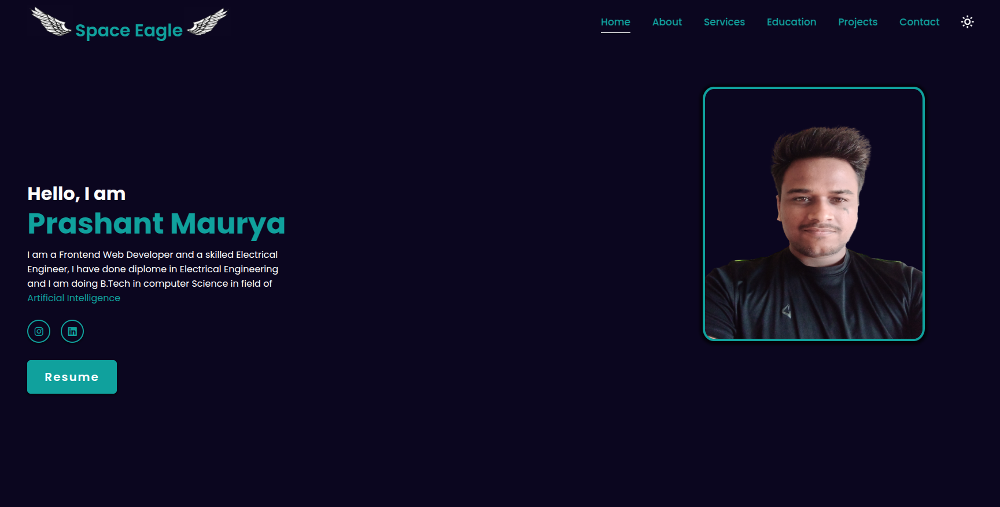

# Prashant Maurya - Portfolio



🔗 **Live Preview:** [Visit My Portfolio](https://prashant1510.github.io/prashant-portfolio/)

## 🚀 About the Project
This is my personal portfolio website, built using **HTML, CSS, and JavaScript**. It showcases my skills, projects, and educational background.

## 🛠 Technologies Used
- **HTML** - Structuring the web pages
- **CSS** - Styling and layout
- **JavaScript** - Adding interactivity

## 📂 Project Structure
```
portfolio/
│── index.html      # Main HTML file
│── styles.css      # CSS styles
│── script.js       # JavaScript file
│── assets/         # Images and other assets
│── README.md       # Project documentation
```

## 📸 Features
✔️ Fully responsive design<br>
✔️ Interactive animations and transitions<br>
✔️ Projects showcase section<br>
✔️ Contact form for inquiries

## 📬 Contact
If you have any questions, feel free to reach out:
- 📧 Email:  mauryaprashant1510@gmail.com
- 💼 LinkedIn: [My LinkedIn](https://www.linkedin.com/in/prashant-maurya-017776246/)
- 🐙 GitHub: [@Prashant1510](https://github.com/Prashant1510)

---
🌟 *Don't forget to star the repo if you like it!* 🚀
